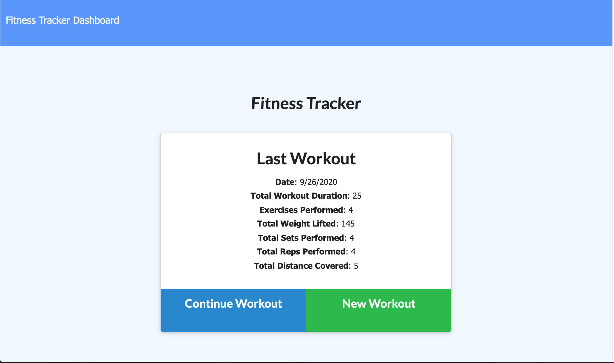

# Workout Tracker

## Description

Technologies: Nosql, MongoDB and Mongoose NPM

This application is a work out tracker using a Mongo database with Mongoose schema and handles routes with Express.

When the user loads the page, they should be given the option to create a new workout or continue with their last workout.

The user should be able to:

  * Add exercises to a previous workout plan.
  * Add new exercises to a new workout plan.
  * View the combined weight of multiple exercises on the `stats` page.

This application is deployed to Heroku and is connected to a database using Mongo Atlas.

## View Application:

* [Heroku Link: https://jennifoo-workout-tracker.herokuapp.com/](https://jennifoo-workout-tracker.herokuapp.com/)

## User Story

As a user, I want to be able to view create and track daily workouts. I want to be able to log multiple exercises in a workout on a given day. I should also be able to track the name, type, weight, sets, reps, and duration of exercise. If the exercise is a cardio exercise, I should be able to track my distance traveled.

## Business Context

A consumer will reach their fitness goals more quickly when they track their workout progress.
